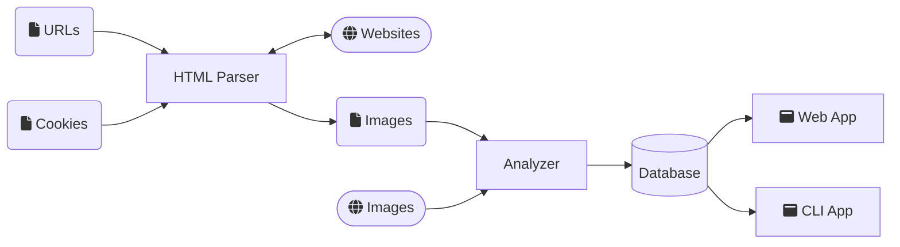

# About

A simple reverse image search engine, similar to *Google Images* or *TinEye*.

Can parse online HTML pages or local folders.
Reverse image search is performed via CLI or a web-application.

Uses *dhash* as fingerprinting algorithm.


Probably won't scale well, but works fine for personal use.


# Installation

* Requires Python 3.8 or newer
* Install dependencies via ```pip install -r requirements.txt```


# Workflow

## Create Project

Use the ```new_project.py``` script to create a new project at a given location:

```shell
python new_project.py C:\my_project
```


## Parse Sources

In the new project folder, edit the *to_parse\sources.txt* file.
Add URLs or local folders to parse.

```
http://example.com
C:\my_images
```

The ```img_filter.txt``` file is an exclusion list. Image URLs that contain a certain string are not processed further.

In the folder *cookies*, create a new file for each domain for which cookies are needed in the request.
The file must be named after the domain e.g. ```example.com.json```, and must contain the cookie data as JSON:

```json
{"PHPSESSID": "1234579"}
```


Run the ```parse.py``` script to search for images on the web pages or in the folders.

```
python parse.py C:\my_project
```

The *to_analyze* folder contains now a text file for each parsed website or folder.
The text files list all found image URLs.


## Analyze Images

To load the images and create the image fingerprints, use the ```analyze.py``` script:

```
python analyze.py C:\my_project
```

The image hashes as well as the image sources are stored in a SQLite database.
The preview images are stored in the *preview* folder.

## Search Image via CLI

Search for an image source by handing over an image URL an the maximum hamming distance to the ```search.py``` script:

```
python search.py C:\my_project https://just.some/image.jpg 10
```

The arguments are:
- absolute path of the project folder
- the URL or absolute path of the image to search for
- the hamming distance threshold

It will list the URLs of folders that contain the same or similar image.


## Search via Web-App

Start the web-app with the ```web.py``` script:

```
python python web.py C:\my_project C:\my_resources
```

The arguments are:
- absolute path of the project folder
- absolute path of the web resources folder


In your browser, open the address ```localhost:5000```.
Enter an image URL in the "Image URL" field and press "Search".
Press ```CTRL+C``` to close the web app.

## Build Web-App as Container


Build container with:

```shell
docker build --tag image-search .
```

Run the container by mounting the project and web resources:

```shell
docker run -it -v C:/my_project:/data -v C:/my_resources:/resources -p 5000:5000 image-search
```

In your browser, open the address ```localhost:5000```.
Enter an image URL in the "Image URL" field and press "Search".
Press ```CTRL+C``` to close the web app.


# Architecture



## Folders

- *apps* stores the mentioned applications
- *searcher* is the module handling analyzing images, writing and querying the database.
- *web_parser* is a utility module used to parse HTML pages for images.

## Web-App Resources

* *templates* contains Jinja templates used by the web app.
* *web* contains the CSS file used by the web app.


## Extension

A **source generator** adds URLs or folders to the list of image sources to process. A custom generator is added by using the  ```source_generator``` decorator:

```python

@web_parser.parser_modules.source_generator
def my_generator(path:str):

    sources = []

    sources.append("https://www.example.com")

    return sources
```

A **html parser** searches the given HTML document for images. A custom parser is added by using the ```html_parser``` decorator:

```python
@web_parser.parser_modules.html_parser
def my_parser(doc: BeautifulSoup, website: str, p:searcher.project.Project) -> None:

    images = []

    src = requests.compat.urljoin(website, "image.jpg")

    if p.check_img_url(src):

        job = web_parser.parser_modules.ImageJob()
        job.image = src
        job.info = ""

        images.append(job)

    return images
```

# To Do

* refactor ```analyzer.py``` and ```web_parser``` module to allow for unit tests.
